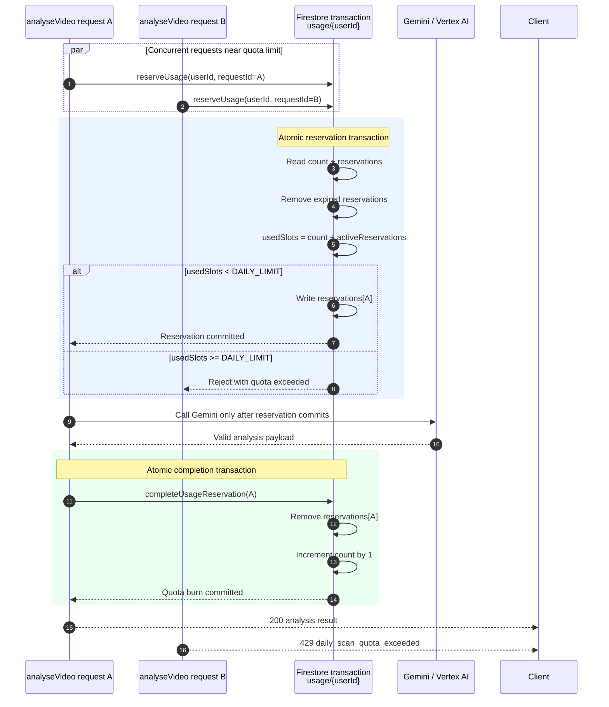

# ADR-0015: Reserve Quota Before Vertex Analysis

- Status: Accepted
- Date: 2026-05-07
- Owners: Kathelix / CatVox
- Related docs: `docs/TRD.md`, `functions/src/usageGuard.ts`, `functions/src/analyse.ts`

## Context

CatVox enforces a free-tier daily scan limit to control Vertex AI cost. Before
this decision, `analyseVideo` performed a non-mutating Firestore quota read near
the start of the request, invoked Gemini only after uploaded-object validation,
and incremented usage after a valid analysis payload was returned.

That preserved the product rule that failed analysis attempts do not burn quota,
but it left a race near the daily limit: two concurrent requests could both read
the same remaining slot before either one incremented usage, then both proceed
to Vertex AI.

Firestore transactions are the right primitive for protecting the quota state,
but external calls such as Gemini must not run inside a transaction because the
transaction function may be retried.

## Decision

`analyseVideo` will reserve one quota slot in Firestore after cheap request and
uploaded-object validation succeeds, but before invoking Vertex AI. The
reservation and quota availability check happen in one Firestore transaction.

The existing `usage/{userId}` document remains the quota owner. It stores:

```ts
{
  count: number,
  lastResetDate: "YYYY-MM-DD",
  reservations: {
    [analysisRequestId: string]: {
      gcsUriHash: string,
      createdAt: Timestamp,
      expiresAt: Timestamp
    }
  }
}
```

The quota invariant is:

```text
count + nonExpiredReservations <= DAILY_LIMIT
```

After Gemini returns a valid parsed payload, the backend completes the
reservation in a second Firestore transaction by deleting the reservation and
incrementing `count`. If analysis fails before a valid payload exists, the
backend best-effort releases the reservation. If cleanup cannot run, the
reservation expires after a short TTL and is pruned opportunistically by later
quota checks.

The iOS client must send a unique `analysisRequestId` with every `analyseVideo`
request. Requests missing this value or sending a malformed UUID are rejected
with HTTP 400. No compatibility path is required for older clients because the
app has not launched publicly.



## Consequences

### Positive

- Prevents concurrent near-limit requests from both proceeding to Gemini on the
  same remaining slot.
- Preserves the product rule that quota is consumed only for successful analysis
  payloads.
- Keeps quota ownership inside the existing `usage/{userId}` document.
- Gives abandoned in-flight work a bounded impact through reservation expiry.

### Negative / Trade-offs

- Adds a second write path around successful analysis: reserve before Gemini,
  then complete after Gemini.
- A backend crash after reservation and before completion can temporarily hold a
  slot until the reservation expires.
- This does not implement full `analyseVideo` idempotency or cached result
  replay; duplicate client retries can still cause duplicate Vertex calls if
  they use distinct request IDs.

## Implementation Notes

- Reservation TTL: 5 minutes.
- The server hashes the GCS URI before storing it in the reservation map.
- Signed URL issuance still performs only an availability check, but that check
  counts active analysis reservations.
- Full analysis idempotency remains a separate future enhancement.
